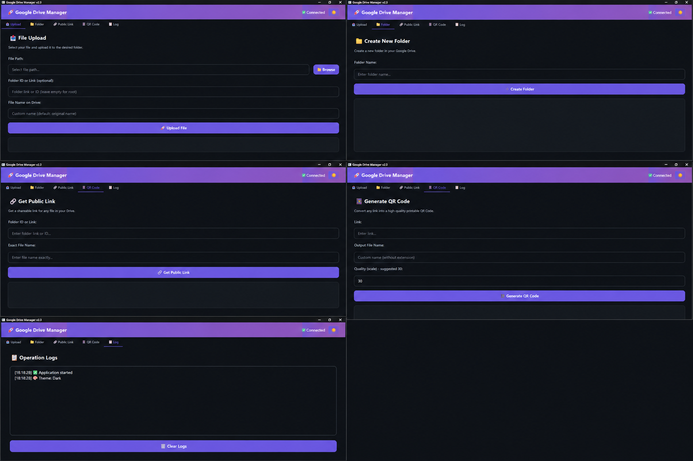

# 🚀 Google Drive Manager

A modern, sleek desktop application for managing Google Drive files with a beautiful PySide6 GUI. Upload files, create folders, generate public links, and create QR codes—all in one place with dark/light themes.



---

## ✨ Features

- **📤 Upload Files** – Upload any file to Google Drive with optional folder selection
- **📁 Create Folders** – Create new folders directly in your Drive
- **🔗 Public Link Generator** – Search for a file and get a shareable public link
- **📱 QR Code Generator** – Convert any link (including Drive links) to a downloadable QR code image
- **🎨 Modern Themes** – Switch between **Dark** and **Light** themes with one click
- **📋 Activity Log** – Real‑time log of all operations
- **⚡ Non‑blocking UI** – Background threading keeps the interface responsive

---

## 📸 Screenshots

_(Coming soon)_

---

## 🛠️ Installation & Setup

### Prerequisites

- Python 3.8 or higher
- A project in [Google Cloud Console](https://console.cloud.google.com/) with **Drive API** enabled
- OAuth 2.0 credentials file (`credentials.json`)

---

### Step 1: Enable Google Drive API

1. Go to [Google Cloud Console](https://console.cloud.google.com/).
2. Create a new project (or select an existing one).
3. Navigate to **APIs & Services > Library** and enable **Google Drive API**.
4. In the **Credentials** section, create an **OAuth 2.0 Client ID** of type **Desktop application**.
5. Download the JSON file and rename it to `credentials.json`.
6. Place this file in the root folder of the application.

---

### Step 2: Install Dependencies

Clone the repository and install the required packages:

```bash
git clone https://github.com/mohammadbarzegar9831-cmd/qr-code-img.git
cd qr-code-img
pip install -r requirements.txt
```

---

### Step 3: Run the Application

```bash
python itdtq.py
```

> **Note:** On first run, your browser will open and ask you to log in to your Google account. After authorization, the token is saved in `token.pickle` so you won't need to log in again next time.

---

## 🧭 How to Use

### Upload Tab (`📤 Upload`)
- **File Path**: Select the file from your system.
- **Folder ID or Link** (optional): If left blank, the file will be uploaded to the root of your Drive.
- **File Name in Drive**: The name that will appear in Google Drive (defaults to the original file name).

### Folder Tab (`📁 Folder`)
- Enter the desired folder name and click **Create Folder**. The folder ID and link will be displayed upon success.

### Public Link Tab (`🔗 Public Link`)
- **Folder ID or Link**: The folder where your file resides.
- **Exact File Name**: Enter the file name exactly (case‑sensitive).
- Once the file is found, public access (`anyone with link can view`) is automatically enabled and the shareable link is shown.

### QR Code Tab (`📱 QR Code`)
- **Target Link**: Any link (e.g., a file or folder link).
- **Output File Name**: Desired name for the PNG image (without extension).
- **Scale (quality)**: A number between 10 and 50 (default: 30); higher values yield better resolution.
- The QR code image will be saved in the application directory.

### Log Tab (`📋 Log`)
- Every operation (upload, folder creation, link generation, theme change, etc.) is logged with timestamps.
- Use the **Clear Log** button to empty the log.

---

## 🎨 Changing the Theme

In the top‑right corner of the header, you'll find the **🌙/☀️** button. Click it to toggle between dark and light themes. The theme preference is saved in `app_config.json`.

---

## 📁 File Structure

| File | Description |
|------|-------------|
| `itdtq.py` | Main application code |
| `requirements.txt` | Python dependencies |
| `app_config.json` | User settings (current theme) |
| `credentials.json` | **(Sensitive)** OAuth credentials – **never commit** |
| `token.pickle` | **(Sensitive)** Authentication token – **never commit** |

---

## ⚙️ Dependencies

- [PySide6](https://pypi.org/project/PySide6/) – GUI framework
- [google-auth-oauthlib](https://pypi.org/project/google-auth-oauthlib/) – Google OAuth authentication
- [google-api-python-client](https://pypi.org/project/google-api-python-client/) – Google Drive API client
- [segno](https://pypi.org/project/segno/) – QR code generation

---

## 🤝 Contributing

We welcome contributions! Here's how you can help:

1. **Fork** the repository
2. Create a new branch (`git checkout -b feature/your-feature`)
3. Commit your changes (`git commit -m 'Add some feature'`)
4. Push to the branch (`git push origin feature/your-feature`)
5. Open a **Pull Request**

---

## 📜 License

This project is licensed under the **MIT License** – see the [LICENSE](LICENSE) file for details.

---

## 📬 Contact

If you have any questions, please [open an issue](https://github.com/mohammadbarzegar9831-cmd/qr-code-img/issues).

**Developer:** Mohammad Barzegar  
**Version:** 2.3
